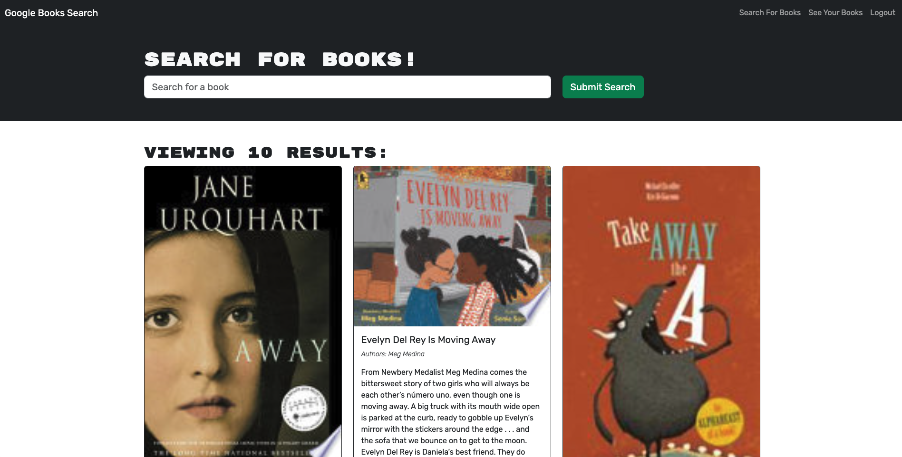

# Book Search Engine

## Description 

The Book Search Engine is a full-stack MERN (MongoDB, Express.js, React, Node.js) application that integrates with the Google Books API to provide users with a clean interface to:

- Search for Books by entering keywords.
- Create a user account or log in using an existing account.
- Save books to their personal library while logged in.
- View and manage (remove) their saved books at any time.
- Log out to end the session.

This project converts a legacy RESTful API to GraphQL for more efficient data fetching and features JWT (JSON Web Token) authentication to protect user data. It’s deployed on Render, so end users can seamlessly explore new books without hosting constraints.

## Table of Contents 

- [Installation](#installation)
- [Usage](#usage)
- [Credits](#credits)
- [License](#license)
- [Contributing](#contributing)
- [Tests](#tests)
- [Questions](#questions) 

## Installation 

To run this project locally, follow these steps: 

1. **Clone the repository:**

    `git clone git@github.com:Connorldailey/Book-Search-Engine.git`

2. **Navigate to the project directory:**

    `cd Book-Search-Engine`

3. **Install dependencies:**

    `npm install`

4. **Start the application:**

    `npm run develop`

If the application does not open automatically, open your browser and navigate to `http://localhost:3000`.

## Usage 

To use the application, visit the [live site](https://book-search-engine-n0dv.onrender.com).

### Basic Functionality

1. **Search for Books**
    - From the homepage, enter a keyword into the search field and click Submit.
    - The app displays multiple results from the Google Books API, showing each book’s title, authors, description, image, and a link to Google Books.
2. **Login/Signup**
    - Click Login/Signup to open a modal, then toggle between Signup and Login.
    - Signup requires username, email, and password. Upon successful signup, you are automatically logged in.
    - Login requires your existing email and password. On success, the modal closes and you’re logged in.
3. **Saving Books** (Requires Login)
    - After logging in, you can search for books as before. Each result now includes a Save button.
    - Clicking Save adds that book to your personal collection.
4. **Viewing & Removing Saved Books**
    - Once logged in, you’ll see a Saved Books menu option. Click it to view a list of your saved books.
    - Each saved book displays a Remove button that, when clicked, deletes it from your library.
5. **Logout**
    - When you’re done, click Logout to end your session. The navigation reverts to Search and Login/Signup options.

## Credits 

Special thanks to The Ohio State University Coding Bootcamp for providing foundational resources and support throughout the development of this project.

### Acknowledgments
- **Google Books API** for enabling robust book searches.

## License 

This project is licensed under the MIT License - see the [MIT License](https://opensource.org/licenses/MIT) for details. 

## Contributing 

Contributions, issues, and feature requests are welcome!

1. **Fork** the repository.
2. **Create** a feature branch (`git checkout -b feature/newFeature`).
3. **Commit** your changes (`git commit -m 'Add a new feature'`).
4. **Push** to the branch (`git push origin feature/newFeature`).
5. **Open** a Pull Request to the main branch.

## Tests 

No automated tests were created for this project; however, extensive manual testing ensures the site behaves as expected:
- Signup/Login Flow thoroughly verified.
- Google Books Search tested with various keywords.
- Save/Remove Books validated for session integrity and database updates.

## Questions 

If you have any questions about this project, feel free to reach out: 

- **GitHub:** [connorldailey](https://github.com/connorldailey)
- **Email:** connorldailey@gmail.com